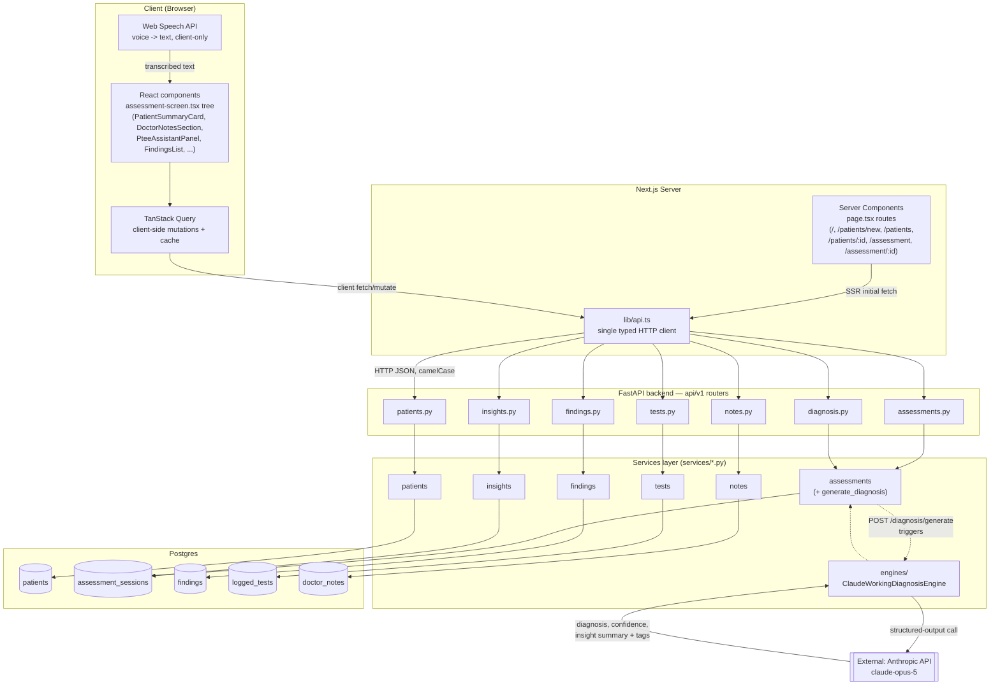
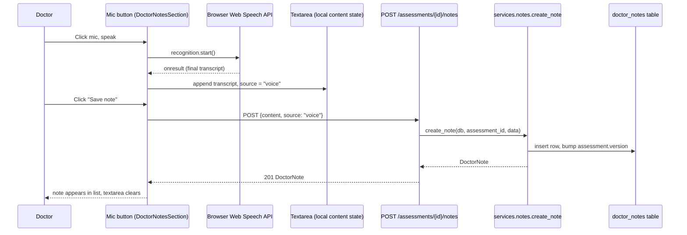

# PTee Health — Data Flow / Process Diagram

This documents the **data framework as actually implemented** in this repo:
how a request moves from a UI action on the Assessment screen, through the
Next.js frontend, into the FastAPI backend, down to Postgres, and — for the
two flows that aren't plain CRUD — out to the browser's Web Speech API and
the Anthropic Claude API.

This file is a structural reference only. For narrative history of *how*
each piece got built (and what was verified along the way), see
[`Progress.md`](Progress.md). For how to actually run the project, see
[`README.md`](README.md).

> **Keep this updated** whenever the data flow changes — a new endpoint, a
> new table, a new external call — the same standing convention already
> applied to `README.md`/`Progress.md`.

## 1. Full-stack data flow



## 2. Callout: AI diagnosis generation

The one flow with a real external network dependency. One combined
structured-output call produces diagnosis text, a confidence score, and the
insight summary/tags together — not three separate calls.

```mermaid
sequenceDiagram
    participant U as Doctor (PteeAssistantPanel)
    participant FE as Frontend (generateDiagnosis mutation)
    participant API as POST /assessments/{id}/diagnosis/generate
    participant SVC as services.assessments.generate_diagnosis
    participant ENG as ClaudeWorkingDiagnosisEngine
    participant AI as Anthropic Claude Opus 5
    participant DB as assessment_sessions row

    U->>FE: Click "Generate with AI"
    FE->>API: POST /assessments/{id}/diagnosis/generate
    API->>SVC: generate_diagnosis(db, assessment_id)
    SVC->>ENG: generate(patient_summary, clinical_summary, findings)
    ENG->>AI: client.messages.parse() structured output
    AI-->>ENG: diagnosis, confidence, insight_summary, insight_tags
    ENG-->>SVC: GeneratedAssessment
    SVC->>DB: persist diagnosis/confidence/insight_*, version += 1
    SVC-->>API: updated Assessment
    API-->>FE: 200 Assessment (or 502 on any Anthropic/key failure)
    FE-->>U: diagnosis panel updates; insights query invalidated
```

## 3. Callout: Doctor's Notes voice dictation

The one flow where the browser itself does work before anything reaches the
backend — no audio is ever sent over the wire, only the transcribed text.



Typed notes follow the same `POST /assessments/{id}/notes` path, just
without the Web Speech API step and with `source: "typed"`.

## 4. Legend / current state

- **Everything in section 1 is real and DB-backed** — there is no
  fixture/in-memory store left anywhere in the backend; all seven routers
  (`patients`, `assessments`, `findings`, `diagnosis`, `tests`, `insights`,
  `notes`) persist to Postgres via SQLAlchemy.
- **The dashed edges** (`S2 -.-> Engine`, `Engine -.-> S2`) mark the one
  conditional branch — it only fires on `POST /diagnosis/generate`, not on
  every assessment request.
- **Not in this diagram because not built yet**: RAG/vector-DB retrieval
  (the Claude call reasons only over the current session's own findings,
  not a clinical knowledge base), the Recommendation Engine ("what to test
  next"), and Treatment/Home Plan/Evaluation data flows. See `Progress.md`
  → "Pending Tasks" for the full list.
